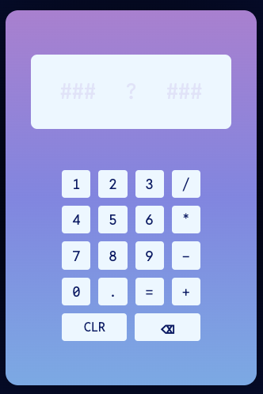
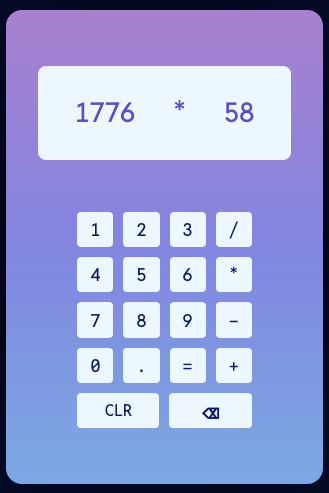

# Calculator Project
Basic calculator that handles numbers up to 6 digits long. 

## Functionality 
- add
- subtract
- multiply
- divide 

Takes two numbers and an operator, which are passed to `operate()` for calculation when either 
1) equal sign is pressed, or
2) a second operator is pressed.
Displayed result is rounded, such that all digits can be contained on the display.

## File Structure
*`index.html`* contains HTML for calculator display structure
- display
- buttons: numbers (10), operators (4),`.`, `=`, `BACK/CLEAR`

*`style.css`* contains CSS for calculator styling

*`script.js`* calculator logic

## Preview

